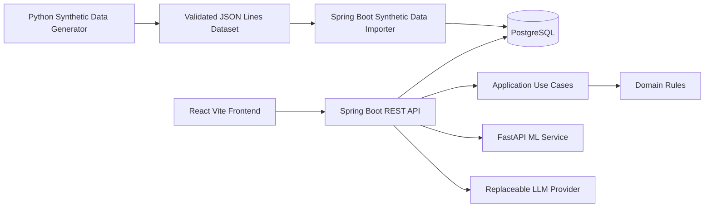
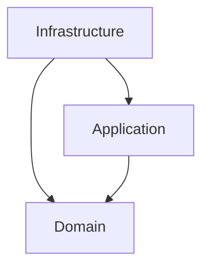

# Architecture

ChampionsClub uses a feature-oriented modular backend with Clean Architecture boundaries where those boundaries improve ownership and readability.



Dependency direction:



## Feature ownership

The backend is grouped by business capability rather than by technical layer across the whole application.

- `sales` owns financial products and contract recording
- `points` owns point rules and point accounting
- `rewards` owns redemption behaviour
- `gamification` owns level thresholds and progress
- `targets` owns target lifecycle and progress
- `analytics` owns read-oriented performance calculations, reporting dates and normalized ranking
- `dashboard` assembles personalized views
- `alerts` owns proactive attention items
- `users` owns identities and advisor type
- `dealerships` owns dealership data
- `security` owns authentication and authorization
- `ai` owns the LLM provider boundary
- `syntheticdata` owns import of the generated canonical local scenario

There is no Admin role and there is no generic configuration module that owns unrelated business concepts.

## Business rule ownership

Java owns deterministic business behaviour such as:

- product eligibility
- point awards
- available point balance
- lifetime gamification progress
- reward eligibility
- target progress
- authorization

Python owns synthetic data generation, data-quality validation and ML work. The synthetic generator creates raw business events but does not calculate authoritative point effects.

The LLM layer receives structured facts after deterministic calculations. It does not calculate business metrics or invent values.

## Canonical data flow

```text
Official aggregate calibration
    -> synthetic raw events
    -> data-quality validation
    -> Java import and business-rule application
    -> PostgreSQL canonical dataset
    -> analytics
    -> forecasting
    -> alerts and recommendations
    -> LLM summaries
```

The generated dataset is a development and evaluation asset. It is not presented as internal Volkswagen data.

When the synthetic profile is active, backend reporting uses the latest loaded synthetic dataset period end as the effective reporting date. This keeps targets, analytics and forecasting aligned with the canonical scenario.

## CQRS

CQRS is kept in-process and lightweight. Commands represent writes such as recording a contract or redeeming a reward. Query services and read models serve dashboards and analytics.

No command bus, event sourcing, Kafka or distributed messaging infrastructure is introduced because the current problem does not require them.
