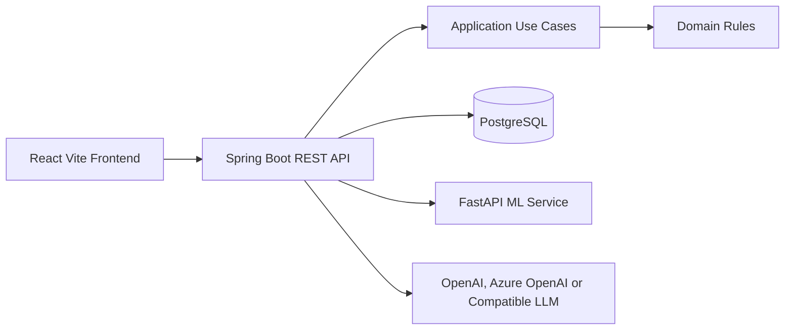
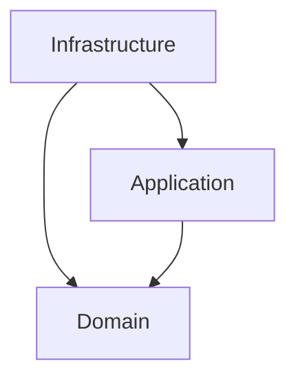

# Architecture

ChampionsClub uses feature-oriented Clean Architecture. Each backend feature keeps its business language close to the code that owns it.

Dependency direction:

Domain contains deterministic rules such as point calculation, reward eligibility, target progress and gamification levels.

Application contains commands and queries. It orchestrates use cases without HTTP, PostgreSQL, React, OpenAI or Python concerns.

Infrastructure contains Spring controllers, security, JPA entities, SQL read models, external AI clients and the ML HTTP client.

The frontend is organised as a role-aware product shell with separate pages for overview, performance, advisors, targets, forecasts, rewards, alerts, AI insights, activity and administration. Demo data is centralised so pages feel connected and product behaviour remains predictable during presentations.
